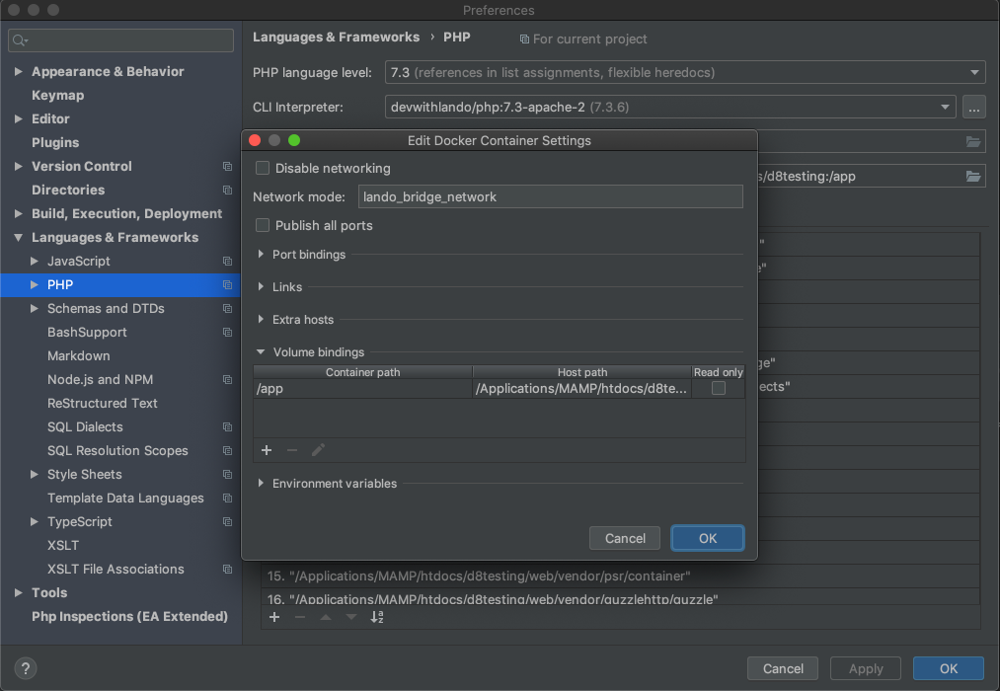

# lando-drupal8-test-debugging

## Purpose
The purpose of this lando "recipe" is to provide an easy setup for Drupal 8 core development, especially writing and debugging tests. This is geared towards PHPStorm, but should also work with other tools. 

## Setup 

### To start:
1. Make sure your software stack is installed and up to date: you need an up to date version of [lando](https://github.com/lando/lando/releases), Docker, Chrome and java.
2. Download the the repo to a new empty dir.
3. Start docker and run lando start from inside this dir.

### Run!

You should now be able to run Drupal 8 core tests. From the command line it looks like this: 
```bash
# unit test
lando phpunit "/app/web/core/modules/toolbar/tests/src/Unit/PageCache/AllowToolbarPathTest.php"
# kernel test
lando phpunit "/app/web/core/modules/field_ui/tests/src/Kernel/EntityDisplayTest.php"
# functional test
lando phpunit "/app/web/core/modules/comment/tests/src/Functional/CommentAnonymousTest.php"
# functional javascript test
sh run-selenium.sh
lando phpunit "/app/web/core/tests/Drupal/FunctionalJavascriptTests/Tests/JSWebWithWebDriverAssertTest.php"
```
NB: You need to provide the path to the test file as seen in the container, not the host.  
NNB: For Functional Javascript tests you need to start the selenium server before running the test. Selenium requires that you have java installed on your host.  
NNNB: Sometimes testing becomes very slow. It can help to restart docker, or even your entire machine.

The test output files can be found in various locations under the /files directory.

### Debugging in PHPStorm: check your PHPStorm debug settings:
- To debug tests run from the command line you only need to provide a php server configuration in PhpStorm. Configure path mappings so PHPStorm knows where you are when debugging. Make sure the server is named 'appserver' and you map the top level path to '/app': Preferences > Languages & Frameworks > PHP > Servers 

Try and enable xdebug ('lando xdebug-on'), enable your debug listener in PHPStorm, setting a breakpoint in a test and running a test. You should now be able to debug your tests. 

NB: Running Docker (for Mac) with a debugger on slows down php quite a bit. Use the tooling provided to quickly switch debugging on/off without restarting your containers: 'lando xdebug-on' and 'lando xdebug-off'.  

### Running tests in PHPStorm: check your PHPStorm debug settings:
- To run tests from the PhpStorm GUI you need to configure a test framework. The test framework needs a CLI interpreter that refers to Docker, so the first thing to do is configure PhpStorm to register Docker: Preferences > Build, Execution, Deployment > Docker 
- Register the CLI PHP interpreter from Docker so you can use its debugger: Preferences > Languages & Frameworks > PHP, then click the '...' button after CLI Interpreter, then add a new From Docker interpreter from the correct Docker image 
- Change the default Docker container settings so the network and path mapping correspond to lando's defaults: Preferences > Languages & Frameworks > PHP, then click the folder icon after button after the line "Docker container" 
- Configure the test framework so PHPStorm can run tests using the PHPStorm GUI: Preferences > Languages & Frameworks > PHP > Test Frameworks, add a PHPUnit by Remote Interpreter and choose the Docker interpreter. Make sure you set the autoload script, config file and bootstrap file using paths that are local to the PHPStorm docker helper container as shown: 

In PHPStorm try to right-click a test function and select 'run'. Running tests via the PHPStorm GUI currently only works with Unit and Kernel tests.

- If you are having trouble getting this to work check the PHP debug settings, especially the max simultaneous connections: Preferences > Languages & Frameworks > PHP > Debug 


### The files in this package do the following:
- **.lando.yml**: the lando file that spins up the apache/php/database containers and set some defaults. Here the init.sh script is called after the containers are up.
- **config/init.sh**: this script (shallow) clones the Drupal git repository to the /web dir, and checks out the default branch. Then composer install runs to complete the vendor dir. It upgrades the phpunit version to work with PHP 7.1, and installs Drush, Drupal Console and Selenium. It creates dirs for file operations in /files. It links config/sites.default.settings.php into the Drupal installation so base setup is automatic. Then it runs drush site-install to setup a working installation. Lastly it configures phpunit.xml for testing. 
- **config/linux-hosts.sh**: The hostname host.docker.internal resolves to the host machine from a container in Docker for Mac and Windows, but not Linux. This script adds this name to the hosts file.
- **config/sites.default.settings.php**: this settings file contains development defaults for Drupal 8. It connects to the lando database container.
- **run-selenium.sh**: this script sets the correct Chrome drive path and launches the project-local standalone Selenium server.


## Future improvements
- run functional and fjs tests via PHPStorm GUI
- export and import PHPStorm settings
- enable Test module by default
- use Chromedriver without Selenium
- cater for different ports if 80 is taken (in SIMPLETEST_BASE_URL)

