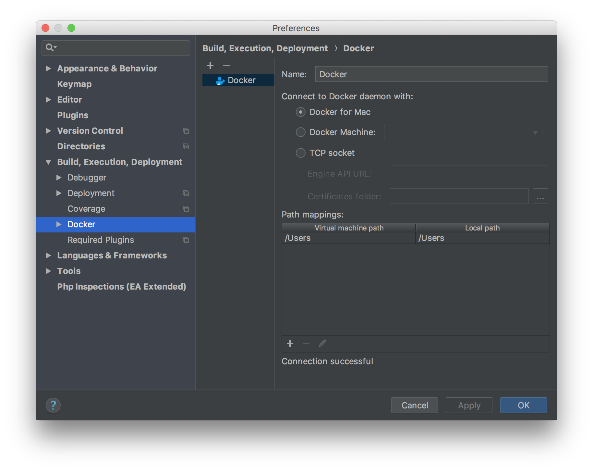
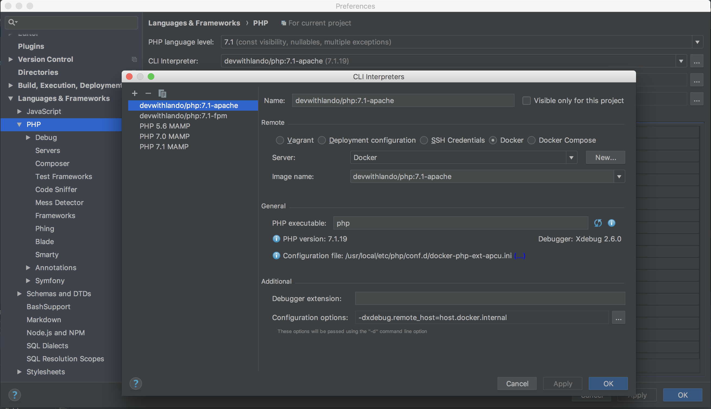
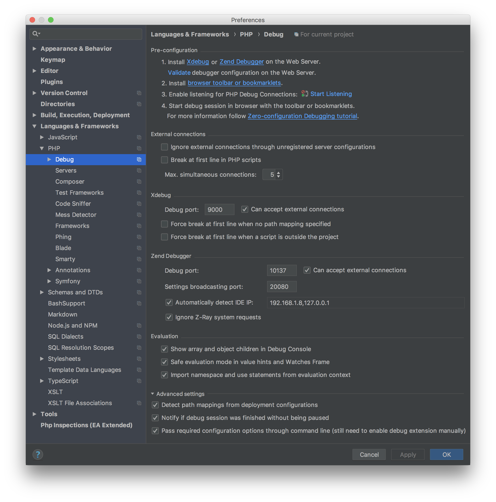
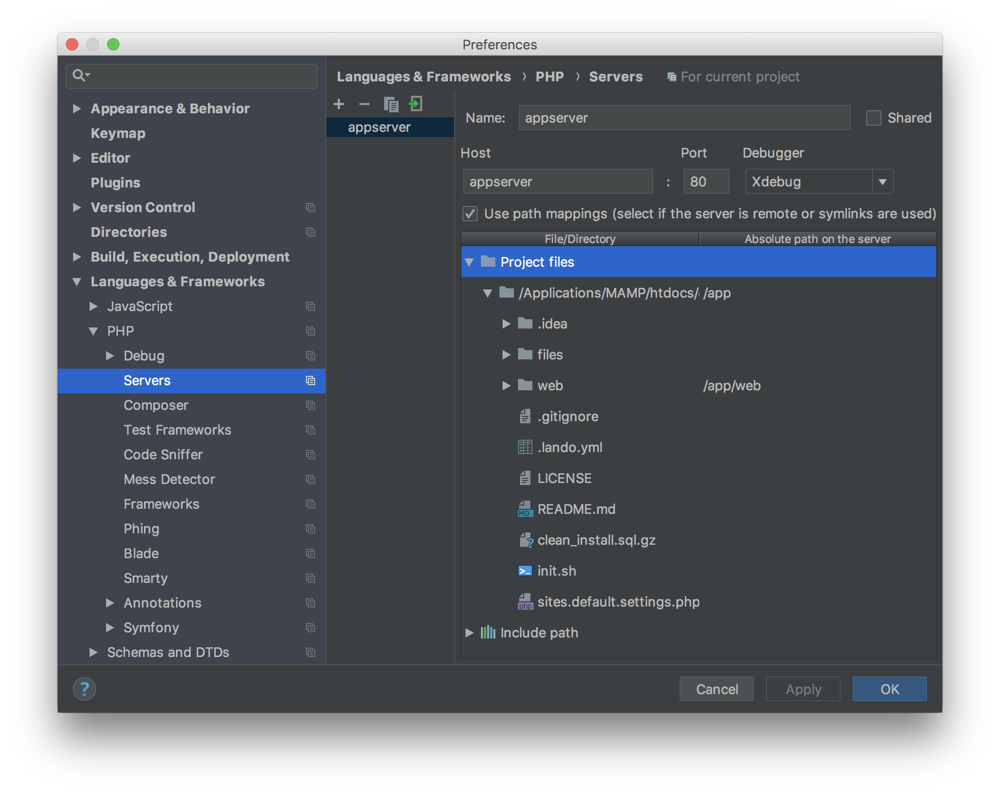
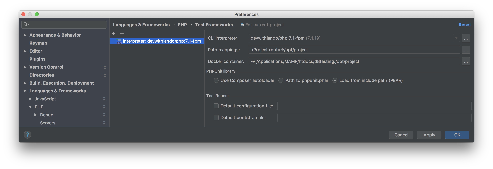

# lando-drupal8-test-debugging

## Purpose
The purpose of this lando "recipe" is to provide an easy setup for Drupal 8 core development, especially writing and debugging tests. This is geared towards PHPStorm, but should also work with other tools. 

## Setup 

### To start:
1. make sure you have [lando](https://github.com/lando/lando/releases) installed.
2. download the .lando.yml and 2 supporting files to a new empty dir.
3. run lando start.  

### Check your PHPStorm debug settings:
- register Docker so you can register its PHP interpreter 

- register the PHP interpreter from Docker so you can use its debugger 
- configure the PHP debug settings, especially the max simultaneous connections 
- configure a server with path mappings so PHPStorm knows where you are when debugging. Make sure the server is named appserver and you map the top level path to /app 
- configure the Test Framework to enable tests via PHPStorm GUI 

## Run!

You should now be able to run and debug Drupal 8 core tests. From the command line it looks like this: 
```bash
# unit test
lando phpunit "/app/web/core/modules/toolbar/tests/src/Unit/PageCache/AllowToolbarPathTest.php"
# kernel test
lando phpunit "/app/web/core/modules/field_ui/tests/src/Kernel/EntityDisplayTest.php"
# functional test
lando phpunit "/app/web/core/tests/Drupal/FunctionalTests/Breadcrumb/Breadcrumb404Test.php"
# functional javascript test
sh run-selenium.sh
lando phpunit "/app/web/core/tests/Drupal/FunctionalJavascriptTests/Tests/JSWebWithWebDriverAssertTest.php"
```
Note that you need to provide the path to the test file as seen in the container, not the host. Try and enable your debug listener in PHPStorm, setting a breakpoint in a test and running the test. If you cannot get this to work please leave feedback on the GitHub [project page](https://github.com/finnef/lando-drupal8-test-debugging).

### The files in this package do the following:
- **.lando.yml**: the lando file that spins up the apache/php/database containers and set some defaults. Here the init.sh script is called after the containers are up.
- **init.sh**: this script (shallow) clones the Drupal git repository to the /web dir, and checks out the default branch. Then composer install runs to complete the vendor dir. It upgrades the phpunit version to work with PHP 7.1, and installs a local Drush in the container. It creates dirs for file operations in /files. It links sites.default.settings.php into the Drupal installation so base setup is automatic. Then it runs drush site-install to setup a working installation. Lastly it configures phpunit.xml for testing. 
- **sites.default.settings.php**: this settings file contains development defaults for Drupal 8. It connects to the lando database container.


## Future imporvements
- run tests via PHPStorm GUI
- find out why we cannot use phpunit 7
- export and import PHPStorm settings
